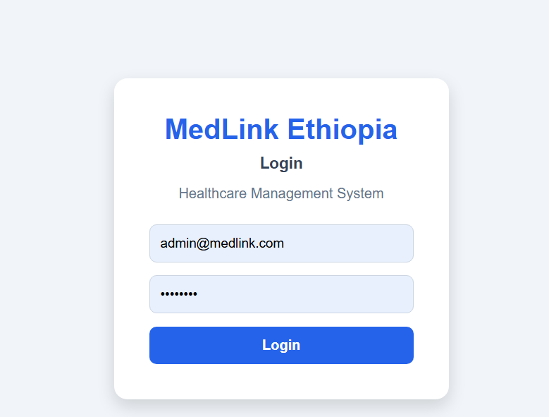
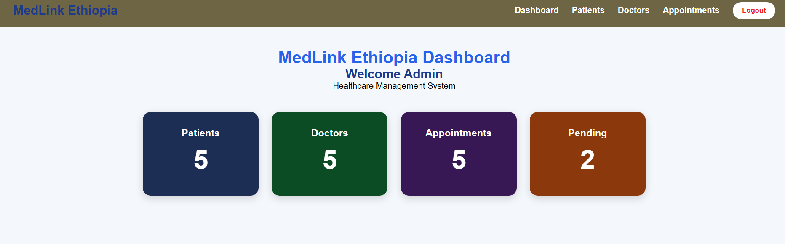
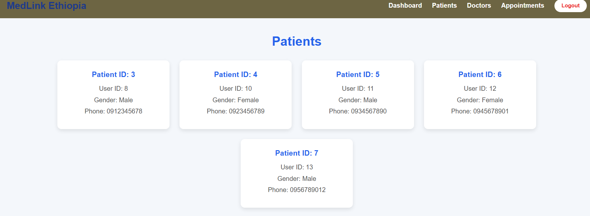
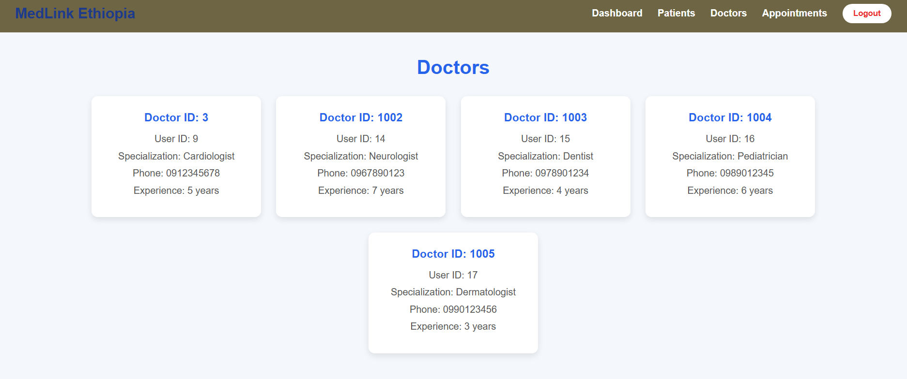
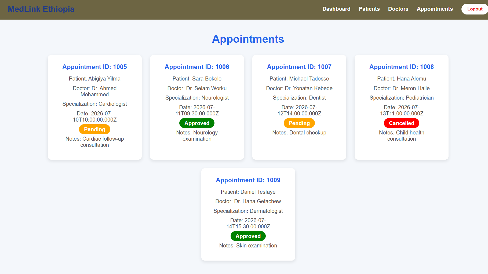

# MedLink Ethiopia 🏥

A full-stack healthcare management system designed to manage patients, doctors, and appointments efficiently.

---

# 📌 Project Overview

MedLink Ethiopia is a web-based hospital management system that allows administrators to manage healthcare information through a simple and user-friendly interface.

The system provides authentication, patient management, doctor management, appointment tracking, and dashboard statistics.

---

# 🚀 Features

## Authentication
- Secure admin login
- JWT-based authentication
- Protected API routes
- Logout functionality

## Dashboard
- Total patients count
- Total doctors count
- Total appointments count
- Pending appointments count

## Patient Management
- View registered patients
- Display patient information:
  - Name
  - Gender
  - Phone
  - Address

## Doctor Management
- View doctors
- Display:
  - Doctor name
  - Specialization
  - Phone
  - Experience years

## Appointment Management
- View appointments
- Display:
  - Patient name
  - Doctor name
  - Specialization
  - Appointment date
  - Status
  - Notes

Appointment status:
- Pending
- Approved
- Cancelled

---

# 🛠 Technologies Used

## Frontend
- React.js
- Vite
- Axios
- React Router

## Backend
- Node.js
- Express.js
- JWT Authentication

## Database
- Microsoft SQL Server

## Development Tools
- Visual Studio Code
- SQL Server Management Studio
- Git & GitHub
- Postman

---

# 📂 Project Structure
MedLink-Ethiopia

├── client
│ ├── src
│ │ ├── components
│ │ │ └── Navbar.jsx
│ │ │
│ │ ├── pages
│ │ │ ├── Login.jsx
│ │ │ ├── Dashboard.jsx
│ │ │ ├── Patients.jsx
│ │ │ ├── Doctors.jsx
│ │ │ └── Appointments.jsx
│ │ │
│ │ └── api
│
└── server
├── src
│ ├── routes
│ ├── controllers
│ ├── models
│ ├── middleware
│ └── config

---

# ⚙️ Installation Guide

## 1. Clone Repository

```bash
git clone https://github.com/abiguermias-creator/MedLink-Ethiopia.git
Database Structure

MedLink Ethiopia uses Microsoft SQL Server.

Main database tables:

Users

Stores login information and user roles.

Patients

Stores patient information:

Date of birth
Gender
Phone
Address
Doctors

Stores doctor information:

Specialization
Phone
Experience years
Appointments

Stores appointment details:

Patient
Doctor
Appointment date
Status
Notes
🔗 Database Relationship
Users
 |
 |---- Patients
 |
 |---- Doctors


Patients
 |
 |---- Appointments ---- Doctors
 📸 Screenshots
 
 
 
 
 
 👨‍💻 Developer

Abigiya Yilma

Computer Science Student
📄 License

This project was developed for educational purposes.